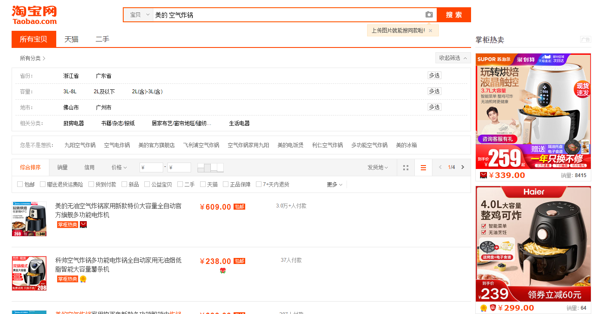
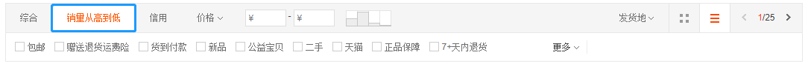
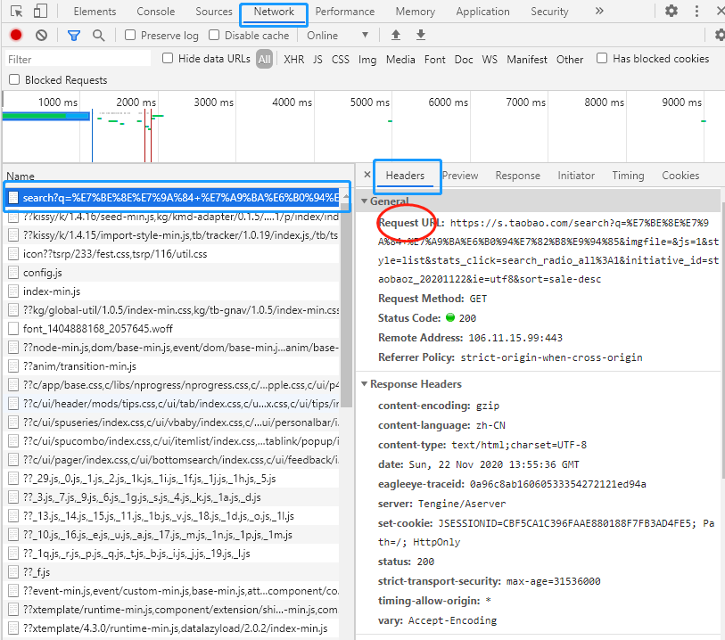
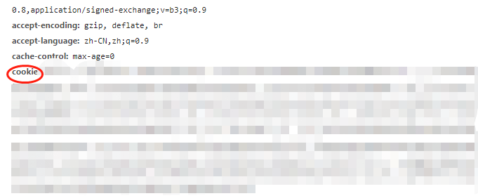
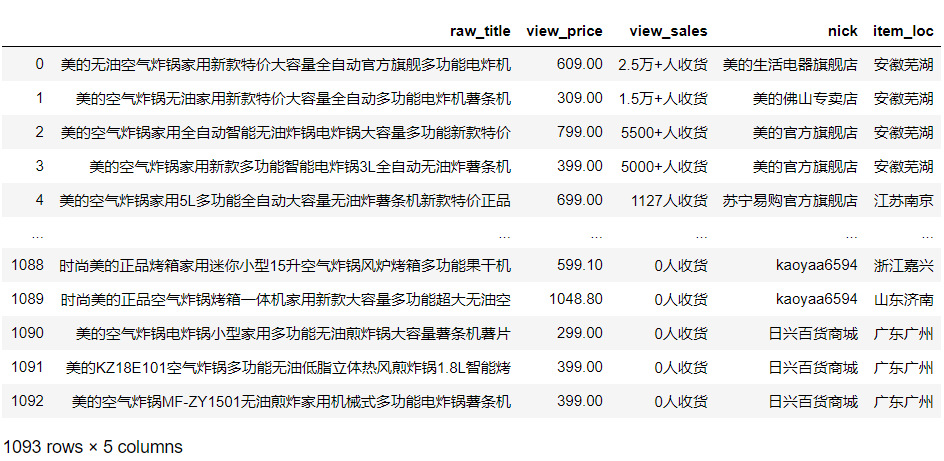

## Preface
I'm really excited to write this post because it may give help to my friends and also help me know Web Crawler better. Although I don't use the crawler too much, I think this is an essential skill in the Internet age.For a quick start, I just show a small example in data crawler.


So let's Start it!

## Have a look, and just look

One of my friend told me that she need the sale data about Midea, Joyoung(...)'s air fryer and Dianbingdang. So I search them in [Taobao](https://www.taobao.com/) firstly. Look, some pictures are as follow:





Then we can click the button of sales-dec and it may be helpful for selection.



And we have get 25 pages we may need. Some sale data, for example,price,numbers,location,is just sorted. The data we see is in a month after I asked one of the Xiaoers(the store's owner). 


## Some Information of Us

OK, now we wanna get the sale data from these pages. We should press the F12 & F5 to get the console and refresh the page.








We should copy the two main items (URL and cookies) above. Because the cookies are my private login information, you just get the cookies in your Browser(ex. Google Chrome).

## Coding

We can write a scripts of Python to get the data.I give a small but useful template as follow:


```python
import requests
import re
import pandas as pd
import json
from bs4 import BeautifulSoup
from tqdm import tqdm
import time
name = '美的' ## 九阳 or  利仁
prot = '空气炸锅' ## 电饼档
pages = 25 ## pages we have get 

df = pd.DataFrame(columns=['raw_title','view_price','view_sales','nick','item_loc'])
cnt = 0
for p in tqdm(range(25)):
    time.sleep(2) ## Avoid anti-spider，sleep 2 seconds
    cookie = 'your cookies'
    url = 'https://s.taobao.com/search?ie=utf8&initiative_id=staobaoz_20201120&stats_click=search_radio_all%3A1&js=1&imgfile=&q={0}+{1}&suggest=history_2&_input_charset=utf-8&wq=&suggest_query=&source=suggest&bcoffset=0&p4ppushleft=%2C44&style=list&sort=sale-desc&s={2}'.format(name,prot,p*44)
    headers = {'User-Agent':'Mozilla/5.0 (Windows NT 10.0; Win64; x64; rv:82.0) Gecko/20100101 Firefox/82.0','Cookie': cookie}

    r=requests.get(url,headers = headers)
    response = r.text

    soup = BeautifulSoup(response, 'html.parser')
    soup.find(string=re.compile("(g_page_config.*?)"))

    script_all = soup.find_all("script")

    text = str(script_all[7])
    text = text.replace(" ","")
    ## Using re to parse 
    m = re.match('<script>\n\ng_page_config=(.*);\n',text)
    str_d = m.group(1)
    ## Format the data
    for n in json.loads(str_d)['mods']['itemlist']['data']['auctions']:
        df.loc[cnt,:] = [n['raw_title'],n['view_price'],n['view_sales'],n['nick'],n['item_loc']]
        cnt+=1
```

## Results


Finally, we should organize the data into dataframe or store them as xxxx.csv to do analysis later. Bingo!