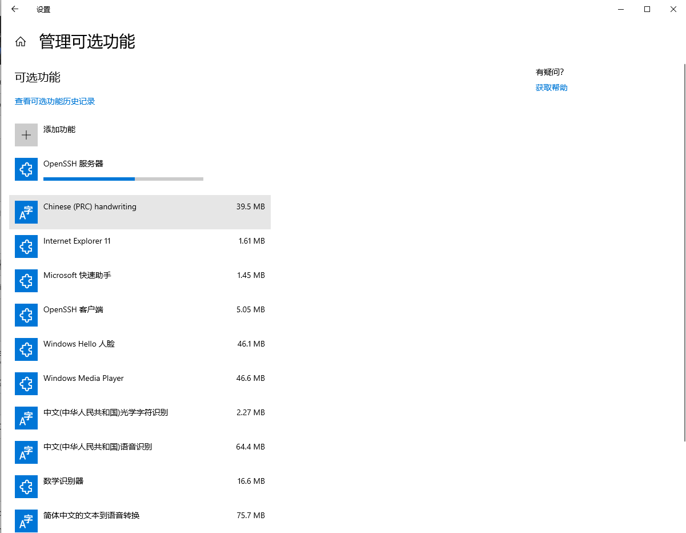

## 1. Enable ssh and ssh server on Windows 10
    
On Windows 10 system, the SSH client is installed by default. But OpenSSH Server is uninstalled which is installed On Linux(like Ubuntu) by default. So that's why we can not use `ssh user-name-on-remote-sys@ip-address-of-remote-sys` to connect to the Windows machine directly.

Here are some pictures about OpenSSH Server installation on Windows 10, we can extend the application just by using optional symbol. 

    

That is very important step, if you close the service of Windows Update, you will not install the OpenSSH Server successfully.(For me, I just close the Update because I don't my machine reboot automatically during the night). So make sure that it is enabled.

    

You need administrator privileges to enable services so open Powershell as Administrator, (right click on the win icon in the bottom)

    

And then, follow these commands:

The last thing to check is the firewall setting for sshd. It by default uses the port number 22. Enabling the service automatically created the following firewall rules,

Note: If you enable sshd you are creating an "open port" for port 22. (Otherwise you wouldn't be able to connect to it.) If your system is exposed to the outside world then that might bother you. You can do things to tighten up security like disallowing passwords and requiring only "public-key" access. I'm not going to cover any of that here. If you are on a private LAN you don't have too much to worry about, but always be security conscious and use good passwords!

## 2. Start Jupyter notebook with --no-browser and --port

There are two ways to start jupyter notebook.
- config the file

 At first generate the config file of jupyter using `jupyter notebook --generate-config`.

 Then you will find the file in the folder,

 

    

you can open it as txt, and find these position, change them as follow and save:

    

Finally, these operation can be replaced by the second way when you just use `jupyter notebook` as command.

- `jupyter notebook --no-browser --port 8899`

(The way just type more words!)

## 3. Connect to windows 10 machine

Here, I start the jupyter service on the windows 10 machine which is located at school using jupyter notebook with config file.

Because of the same LAN, I just use the follow command to connnect on my Linux Laptop.

After I input the password, I start the remote jupyter service on my laplop, just using the server's rescourse.

# BAM!!!

## Reference
[How To Use SSH Client and Server on Windows 10](https://www.pugetsystems.com/labs/hpc/How-To-Use-SSH-Client-and-Server-on-Windows-10-1470/?__cf_chl_captcha_tk__=81df8c0e27d8db49f2bf8016b24bf4ed557de063-1606536000-0-AcHgD47k3sHIAn65uZLgresk1ZDqpssmRlquK20WDsrO_5PM5rXX5PiEuhdjyRMJAH_B3LrKG4y84GV0I4AoKcDxeejojeK3WEFm9Cgb_cqWRmPB4Gl_qfBLLAJHqzGnWiMRHEMdhEP1JSFc_vUEptMHDtlvG4QjsS0Tq4jWP7cEtrcaRX24qs-ccdg7qyuTUljV3pEw_LQcx8ZW9-KkO2P0LP13NFXuLz_yp6sO2sNDA2n7RO32TBf8tophwqe_kjMco6MubHfByVp0elfwFY8hdNIMK2jnGwOgYAj6WDGa_LayamEKaBgBLqTdczZhcfS70Lvd3iaYnuyvtMNPhr6buE_R81HvbUr-Q-vKPUM48TxpNzX0aELYeh5w0lOkyl8VgaVM8QCo8VHO9qsy12dAU8NBtmBglo2L_thQv44g8HhXnlmC10X0etXSc8gh0zyvVUE33SngtTDqovaCI9-aCs-Q5I5tCpwVVdaNPFFV9iNYgSSbgPtYgBNAke_dLmNxLiASEE7tnFrJELYbcM1PAfyL2DZ7Ou2zCfn2UXPk7Cl9sxSfEaYL_q5ZINN6-x-s8YoyT1hjk5YbeH6KJIDRXIvcPXgwDqj2a_wh0enS)

[How To Run Remote Jupyter Notebooks with SSH on Windows 10](https://www.pugetsystems.com/labs/hpc/How-To-Run-Remote-Jupyter-Notebooks-with-SSH-on-Windows-10-1477/)

