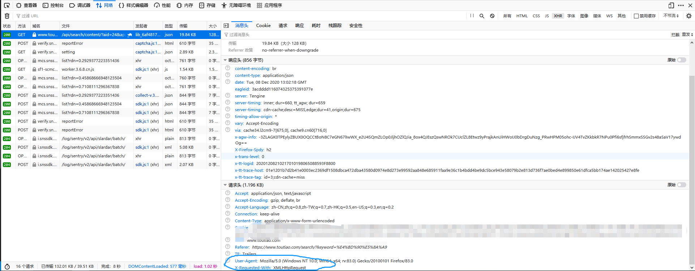
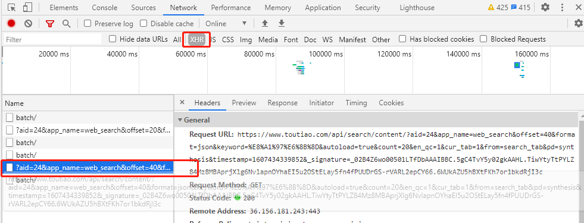

## Introduction
Ajax, Asynchronous JavaScript and XML. Ajax requests are by default asynchronous, which means you must have callbacks that will handle the data from a response. Callback methods are passed in the options hash when making a request:
```javascript
new Ajax.Request('/some_url', {
  method:'get',
  onSuccess: function(transport) {
    var response = transport.responseText || "no response text";
    alert("Success! \n\n" + response);
  },
  onFailure: function() { alert('Something went wrong...'); }
});

<!-- This is the mechanism of javascript>

<!-- Prototype takes the complexity out of client-side web programming. Built to solve real-world problems, it adds useful extensions to the browser scripting environment and provides elegant APIs around the clumsy interfaces of Ajax and the Document Object Model.>


```
The transport for Ajax requests is XmlHttpRequest, we can get the content of response from transport.responseText. It is just similar to Python's `requests` which is contain the request to server and the response from server.

```javascript
var xmlhttp;
if(window.XMLHttpRequest){
    // code for IE7+ Firefox Chrome Opera Safari
    xmlhttp=new XMLHttpRequest();
}else{
    xmlhttp=new ActiveXObject("Microsofe.XMLHTTP");
}
xmlhttp.onreadystatechange=function(){  //1 
    if(xmlhttp.readyState==4 && xmlhttp.status==200)
    {
        document.getElementById("myDiv").innerHTML=xmlhttp.responseText;//2 3
    }
}
xmlhttp.open("POST","/ajax/",true);
xmlhttp.send();

```
There are three steps to finish the update of web by javascript.Firstly, set the monitor and request. Second, parse the content of response. Third, change the content in the Web.

## Ajax analysis

For example, we want to download the beautiful images from [今日头条](https://www.toutiao.com/), let's analyze the Ajax Requests.

At first, we search the word “佐助”, as we can see, there are a lot of news about him. If we want to download these images, we must find the position of them.

<center class="half">
    
</center>

Press F12 and F5 and click the first item, we can find the useful information from Request Headers, which is called `X-Requested-With: XMLHttpRequest`. So we address them as the Ajax website.

<center class="half">
    
</center>

When we choose the item XHR, and slide the mouse wheel, the left block will update the items.
<center class="half">
    
</center>

These URL can be parsed in our python code, the only string will be changed is `offset`. So we regard it as a variable when we write codes.


```python
from urllib.parse import urlencode
from hashlib import md5
import os
import requests
def main(offset):
    json = get_page(offset)
    for item in get_images(json):
        print(item)
        save_image(item)
        
def get_page(offset):
    params = {
        'aid':'24',
        'app_name':'web_search',
        'offset':offset,
        'format':'json',
        'keyword':'佐助',
        'autoload':'true',
        'count':'20',
        'en_qc':'1',
        'cur_tab':'1'
    }
    url = 'https://www.toutiao.com/api/search/content/?' + urlencode(params)
    try:
        
        response = requests.get(url)
        if response.status_code == 200:
            return response.json()
    except requests.ConnectionError:
        return None
def get_images(json):
    
    if json.get('data'):
        for item in json.get('data'):
            title = item.get('title')
            images = item.get('image_list')
            if images:
                for image in images:
                    yield {
                        'image':image.get('url'),
                        'title':'佐助’
                    }
def save_image(item):
    if not os.path.exists(item.get('title')):
        os.mkdir(item.get('title'))
    try:
        response = requests.get(item.get('image'))
        if response.status_code == 200:
            file_path = '{0}/{1}.{2}'.format(item.get('title'),md5(response.content).hexdigest(),'jpg')
            if not os.path.exists(file_path):
                with open(file_path,'wb') as f:
                    f.write(response.content)
            else:
                print('Already Downloaded', file_path)
    except requests.ConnectionError:
        print('Failed to Save Image')

main(20)
```
Finally, there will be a folder in our default path and some images in it:
<center class="half">
    
</center>

<center class="half">
    
</center>

