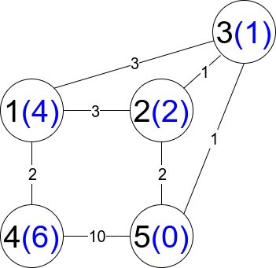

## [从第一个节点出发到最后一个节点的受限路径数](https://leetcode-cn.com/problems/number-of-restricted-paths-from-first-to-last-node/)

现有一个加权无向连通图。给你一个正整数 n ，表示图中有 n 个节点，并按从 1 到 n 给节点编号；另给你一个数组 edges ，其中每个 edges[i] = [ui, vi, weighti] 表示存在一条位于节点 ui 和 vi 之间的边，这条边的权重为 weighti 。

从节点 start 出发到节点 end 的路径是一个形如 [z0, z1, z2, ..., zk] 的节点序列，满足 z0 = start 、zk = end 且在所有符合 0 <= i <= k-1 的节点 zi 和 zi+1 之间存在一条边。

路径的距离定义为这条路径上所有边的权重总和。用 distanceToLastNode(x) 表示节点 n 和 x 之间路径的最短距离。受限路径 为满足 distanceToLastNode(zi) > distanceToLastNode(zi+1) 的一条路径，其中 0 <= i <= k-1 。

返回从节点 1 出发到节点 n 的 受限路径数 。由于数字可能很大，请返回对 109 + 7 取余 的结果。


### 示例1：
<pre>
<strong>输入:</strong> n = 5, edges = [[1,2,3],[1,3,3],[2,3,1],[1,4,2],[5,2,2],[3,5,1],[5,4,10]]
<strong>输出:</strong> 3
</pre>


<center class="half">
    
</center>


### 思路分析:

堆优化Dijkstra + 动态规划


### 提交代码

```C++

class Solution {
public:
    int countRestrictedPaths(int n, vector<vector<int>>& edges) {
        vector<int> dis(n+1,INT_MAX);
        vector<vector<pair<int,int>>> lk(n+1);
        for(auto e:edges)
        {
            int u=e[0],v=e[1],w=e[2];
            lk[u].push_back({v,w});
            lk[v].push_back({u,w});
        }
        dis[n]=0;
        priority_queue<pair<int,int>> heap;
        heap.push({0,n});
        while(!heap.empty()){
            auto [d,x]=heap.top();heap.pop();
            d=-d;
            if(d!=dis[x])continue;
            for(auto [y,w]:lk[x])
                if(dis[y]>dis[x]+w){
                    dis[y]=dis[x]+w;
                    heap.push({-dis[y],y});
                }
        }
        
        //for(int i=1;i<=n;++i)printf("%d%c",dis[i]," \n"[i==n]);
        
        vector<int> q(n),dp(n+1);
        for(int i=1;i<=n;++i)q[i-1]=i;
        sort(q.begin(),q.end(),[&](int x,int y){return dis[x]>dis[y];});
        dp[1]=1;
        int D=1e9+7;
        for(auto x:q)
            for(auto [y,w]:lk[x])
                if(dis[y]<dis[x])
                    (dp[y]+=dp[x])%=D;
        return dp[n];
    }
};
```
